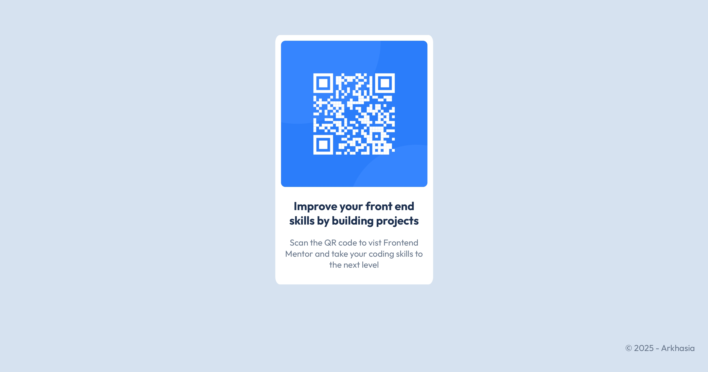

# Frontend Mentor - QR code component solution

This is a solution to the [QR code component challenge on Frontend Mentor](https://www.frontendmentor.io/challenges/qr-code-component-iux_sIO_H). Frontend Mentor challenges help you improve your coding skills by building realistic projects. 

## Table of contents

- [Overview](#overview)
- [Screenshot](#screenshot)
- [Built with](#built-with)
- [Useful ressources](#links)

## Overview

This is a fun project to dive a little deeper into web development. A great way to get more comfortable with basic front-end elements.

### Screenshot

### Built with

- Semantic HTML5 markup
- CSS custom properties
- Flexbox

### Useful resources

- [CSS Flexbox](https://css-tricks.com/snippets/css/a-guide-to-flexbox) - This helped me with css flexbox. I really recommended it.
